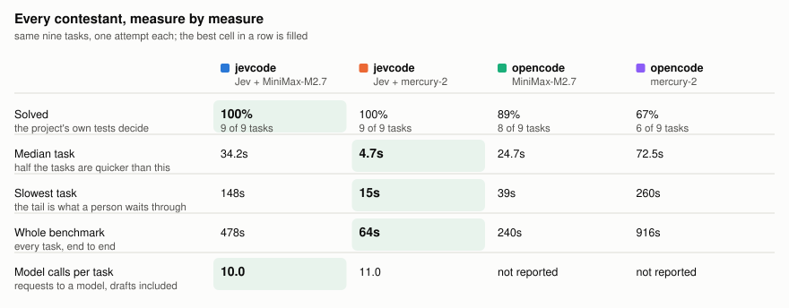
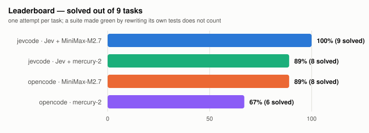

<p align="center">
  
</p>

<p align="center">
  <a href="https://autopasha.github.io/jevcode/">Project page</a> ·
  <a href="#install">Install</a> ·
  <a href="#in-the-terminal">Terminal</a> ·
  <a href="#what-it-does-on-real-work">Measurements</a> ·
  <a href="#against-other-agents">Comparison</a> ·
  <a href="#how-a-step-works">How it works</a>
</p>

A coding agent whose decisions are made by a model that cannot write a single
character of code.

[Jev](https://typesafe.ai) is a System One model. You hand it a state and typed
questions — is this true, which of these, where on this scale — and it answers
all of them at once with calibrated probabilities. It never writes text. Ask it
for a function and it has nothing to say.

That restriction buys something. A decision costs a fraction of a cent, comes
back in well under a second, and 256 of them fit in one request. So jevcode
asks constantly: which file does this task live in, which function, which of
these six drafts is correct, is this command about to delete something, is the
job actually done. A small fast model does the typing, and it is never asked
what to do.

```
$ jevcode "make Cart.total accept a discount argument, taken off before tax"

step 1 search  p=0.50 conf=0.54
        searched 'Cart' → 2 files
step 2 read    p=0.90 conf=0.98
        opened cart.py (21 lines)
step 3 edit    p=0.80 conf=0.86
        writing cart.py Cart.total (lines 14-15) — 6 candidates
        dropped 4: same as candidate A
        chose A (p=0.72, works=0.93, out-of-scope=0.10)
        python3 -m unittest discover -s tests -q passed with candidate A

done — task carried out and checked
73 decisions in 6 requests (5.2s, 41k tokens in) · 6 writer calls (12.6s) · 7.6s total
```

Every number on screen is a probability the model returned, not a summary of
what it was thinking. When the agent goes somewhere odd you can see which
question it answered badly, and fix that question.

## In the terminal

`jevcode` with no arguments opens a session in the current directory. It is a
prompt, not a dashboard: everything scrolls, everything can be copied out, and
the only thing that repaints is the status line.

<p align="center">
  
</p>

<sup>Recorded with `jevcode --demo`, which answers from a table so the interface
can be shown without a key. The same recording moving:
[docs/assets/demo.svg](docs/assets/demo.svg), and the raw cast beside it if you
would rather replay it yourself.</sup>

- `@path` puts a file in front of the agent, matched on any tail of its path.
- `!command` runs a shell command yourself without leaving.
- `/undo` and `/redo` move the files, not just the transcript — the text before
  and after every edit is kept in the session, so undo works in a directory that
  is not a git repository at all.
- Sessions survive the terminal closing: `jevcode -c` carries on, `/sessions`
  lists them.
- Before an edit is applied or a command is run you get the diff and a question,
  with "yes, and stop asking" as the second option. `--permission allow` for a
  script, `deny` to watch it think without letting it touch anything.
- `AGENTS.md` is read if the project has one — the same file the other terminal
  agents look for.

| command | |
| --- | --- |
| `/help` | the list |
| `/new` `/clear` | start over |
| `/sessions` `/resume` | list and switch |
| `/undo` `/redo` | move the files back and forward |
| `/diff` | everything this session changed |
| `/cost` | decisions, requests, seconds, money |
| `/models` `/model <name>` | who decides, who writes, swap the writer |
| `/details` | show or hide each decision as it is made |
| `/permission ask\|allow\|deny` | how much to ask |
| `/init` | write an `AGENTS.md` |
| `/export` `/editor` `/compact` `/exit` | |

Try the whole thing without a key:

```bash
jevcode --demo
```

That opens a throwaway sample project with one real bug in it and answers from a
canned table — no model is called and nothing is charged. It is a tour of the
interface, not of the quality; every number in this README comes from real runs.

## Why it is shaped this way

An ordinary coding agent spends its budget on deliberation. Each step means
running a large model over a growing transcript, so steps are slow, expensive,
and precious — which is why agents commit to the first plausible move and
discover the alternatives by walking into them.

Reverse the economics and the shape changes:

| | ordinary agent | jevcode |
| --- | --- | --- |
| a decision | seconds, cents, a full context replay | ~200 ms, ~$0.0001, no transcript |
| decisions per step | one | dozens, in one request |
| looking ahead | take the step and find out | score the whole tree first |
| picking among drafts | keep the first one | write six, judge six, keep the best |
| checking a command | a deny list of regexes | three questions about this command |
| context growth | every file read stays in the prompt forever | state is assembled per question |

The last row matters more than it looks. Nothing accumulates in a prompt here.
The state handed to Jev is built fresh for each request out of what the current
question needs, so a long session does not slowly poison itself with everything
it has ever read.

## What it does on real work

Measured on 2026-09-20, by the benchmarks in `bench/`, against this repository
and HumanEval.

**Judging beats guessing — where there is something to judge.** The writer
produces N drafts for each of 80 HumanEval tasks, the tests decide which ones
work, and Jev picks without ever seeing the tests:

| writer | one draft | Jev picks among N | ceiling |
| --- | --- | --- | --- |
| llama-3.2-3b (8 drafts) | 49% | **78%** | 85% |
| qwen3.5-9b (6 drafts) | 94% | 94% | 100% |

A three-billion-parameter model with a judge in front of it lands within seven
points of the best any of its drafts could do, at 1148 questions across 80
requests and five minutes of model time. The second row is the honest other
half: when the writer is already right 94% of the time on tasks this size, there
is nothing left for a judge to win, and it wins nothing. Candidates are
deduplicated before judging — a Choice splits one unit of probability across its
options, so three copies of the right answer split their own vote three ways and
lose to a single wrong one. That detail is worth ten points on the first row.

**Finding the place, with no index.** 15 questions about this repository, each
with a known answer. No embeddings, no vector store, nothing to keep fresh —
every run reads the tree from scratch: **13/15 correct**, 30 questions in 15
requests, 12 seconds total.

**Small repositories end to end.** `bench/tasks/` holds nine small projects,
each with a feature missing and a failing test that demands it. The agent gets
one sentence and the directory; the project's own tests decide. No partial
credit. The pictures are further down, where the other agents are; here is
the run itself.

All nine ran on 2026-09-21 against commit 94b0162, one attempt each, writer MiniMax-M2.7:

| task | solved | decisions | requests | wall | cost |
| --- | --- | --- | --- | --- | --- |
| cart — a discount argument | yes | 14 | 1 | 12.9s | 0.04 RUB |
| ttlcache — entries outliving their TTL | yes | 14 | 1 | 15.2s | 0.04 RUB |
| jsdedupe — dedupe in a JavaScript project | yes | 14 | 1 | 18.8s | 0.04 RUB |
| jsonflag — a `--json` flag on a CLI | yes | 14 | 1 | 20.8s | 0.04 RUB |
| duration — report whole days | yes | 14 | 1 | 34.2s | 0.04 RUB |
| csvparse — doubled quotes inside a quoted field | yes | 14 | 1 | 67.6s | 0.04 RUB |
| retry — a max_delay cap in two functions | yes | 30 | 2 | 78.7s | 0.09 RUB |
| slugify — a new module from scratch | yes | 86 | 8 | 82.4s | 0.29 RUB |
| pagesize — thread an argument through two modules | yes | 82 | 6 | 147.5s | 0.25 RUB |

**Nine out of nine**, 0.10 RUB plus about $0.015 of writer per task. Six of them
take a single request to Jev: one fan-out of questions, one region written six
ways, one test run that picks the winner, done.

That single-request shape is what the earlier version of this table was missing.
On the same nine tasks this morning the agent solved five, and every failure
looked the same — over twenty-five requests and the note `ran out of
steps`. It was not getting hard tasks slowly wrong. It was finishing them and
not noticing: the loop asked the model whether the work was done while the
project's own test command had already answered. Three things changed that, and
each is a fact replacing an opinion — a green suite ends the run, a suite with
fewer failures counts as progress and is kept rather than undone, and the
drafts race each other through the real test command instead of being judged
one at a time.

What is left in the time column is the writer, not the decisions. csvparse takes
one request to Jev and sixty-eight seconds, and nearly all of that is six drafts
being typed. Point `JEVCODE_WRITER_MODEL` at a faster model and the same task
comes out in five seconds with nothing else changed — which is the argument
for keeping the decisions and the typing in separate models.

### Where the seconds go

`bench/profile.py` times a run by phase — wall clock, not a sum, since drafts
are written in parallel:

| task | total | System One | writer | tests | your machine |
| --- | --- | --- | --- | --- | --- |
| cart | 6.8s | 4.4s (65%) | 2.1s (31%) | — | 0.2s (4%) |
| retry | 22.4s | 10.0s (45%) | 11.6s (52%) | — | 0.8s (4%) |
| jsonflag | 43.7s | 11.6s (27%) | 31.7s (73%) | — | 0.4s (1%) |
| bowling (a class from nothing) | 13.1s | 1.0s (8%) | 10.0s (77%) | 1.9s (14%) | 0.1s (1%) |

Reading files and applying patches — the part people assume is slow — is about
1% of a run. A System One request costs about 0.8s whatever you ask it, so on a
short task the decisions dominate and on a long one the drafts do. The first
three rows were measured before the drafts raced each other through the test
command; the last one after, which is why it has a column of its own for the
tests and why its one request is the whole of its decisions.

Keeping the connection open is worth measuring rather than assuming.
`bench/handshake.py` asks the same trivial question ten times each way:

| transport | median | first call |
| --- | --- | --- |
| fresh socket per call | 0.541s | 1.101s |
| kept-alive pool | 0.480s | 0.735s |

About 60ms a call, 11% — real on a run that makes fifty requests, and smaller
than it looked before it was measured. The handshake is cheap because the
gateway is near; on a distant endpoint the same pool saves a great deal more.
The honest conclusion is that the round trips themselves are the cost, which is
why the next thing worth building is deciding several steps in one request
rather than making the trip faster.

### The writer sets the clock, and it is not the writer you would guess

Six exercises from the public set, chosen because each is the case this agent
is supposed to be bad at: a class written from an empty skeleton. Same commit,
same tasks, same five-minute limit, one attempt each. Only the writer differs:

| writer | solved | total wall | per task |
| --- | --- | --- | --- |
| inception/mercury-2 | **6/6** | 75s | 7–27s |
| MiniMax-M2.7 | 4/6 | 971s | 44–135s, two over the limit |

Thirteen times the wall clock for the same six tasks and the same decisions,
because one writer thinks before it types and the other does not. Asked for a
whole class with room for 8000 tokens, MiniMax-M2.7 spent every one of them on
reasoning — which this provider does not put in `content` at all — and returned
nothing, four times out of four, in 110 seconds. The same brief to mercury-2:
four usable drafts in 11.6 seconds. The thinking writer's times also swing hard
— the same task came out at 119s, 249s and 455s on different runs — because how
long a model thinks is not something you can budget for.

What does not change between those two rows is the agent. Look again at the
bowling line in the table above: one request to Jev, one second, eight per cent
of a run. The whole decision layer of this agent is that second. Everything
else is typing, which is why the writer is a setting and not a component.

One more line about that writer, because it is not a footnote. mercury-2 cannot
be driven by a conventional agent at all — pointed at it, opencode dies with
`INVALID_TOOL_RESPONSE` on five of these six tasks, because the model does not
emit usable tool calls. It does not need to here. The writer in this design is
never asked to call anything; it types code into a brief assembled by the code
around it, so models that no tool-calling harness can use are ordinary writers
for jevcode.

## Against other agents

The only comparison worth printing is one you can re-run, so the harness is in
the repository rather than the claims.

```bash
cp bench/contestants.json.example bench/contestants.json   # edit to what you have
python3 bench/compare.py --who all --repeat 3              # everyone, every task
python3 bench/publish.py                                   # redraw this section
```

Every contestant gets an untouched copy of the same directory, the same
sentence, the same time limit, and is judged by the project's own tests. No
prompt tuned per agent, no retries, no partial credit. `contestants.json` is a
plain list of command templates with `{dir}` and `{task}` in them — it is yours
to read and to argue with, which is the point.

All four rows below are the same nine tasks. Two agents, two writers, every
combination — because an agent is only ever as quick as what it writes with,
and a comparison that does not say which writer it used is not a comparison:

<p align="center">
  
</p>

Read the first two columns: same writer, same tasks, different harness.
We take nine out of nine against eight, and lose the clock — 478 seconds
against 240 — because an edit here asks for six drafts and MiniMax-M2.7 thinks
at length before each one, and a draft is now given the time to finish thinking
rather than being cut off at two minutes. That is the honest half, and it is on
the board.

The last two columns are the same experiment with a writer that does not think
first, and there the gap stops being a percentage:

<p align="center">
  
</p>

Every one of the nine is quicker here, by between 3.4 and 56 times, and the
whole benchmark takes one minute instead of fifteen. The reason is not that
our loop is cleverer at that moment — it is that a conventional agent needs its
model to call tools, and mercury-2 does not emit tool calls at all. opencode
spends the time flailing at that, and gets two thirds of the way. Our writer is never asked to call
anything: it types code into a brief the surrounding code assembled, so a model
no tool-calling harness can drive is an ordinary writer here, and it happens to
be the quickest one available.

That is what the decisions buy. Not a better draft — a harness that can use a
writer chosen for speed instead of for manners.

<p align="center">
  
</p>

All four, by tasks solved:

<p align="center">
  
</p>

<!-- bench:table -->

| agent | solved | median task | whole benchmark | model calls per task |
| --- | --- | --- | --- | --- |
| jevcode · Jev + mercury-2 | 9/9 (100%) | 4.7s | 64s | 11.0 |
| jevcode · Jev + MiniMax-M2.7 | 9/9 (100%) | 34.2s | 478s | 10.0 |
| opencode · MiniMax-M2.7 | 8/9 (89%) | 24.7s | 240s | — |
| opencode · mercury-2 | 6/9 (67%) | 72.5s | 916s | — |

Nine tasks, one attempt each. Both jevcode rows were re-run on 2026-09-21 against commit 94b0162; the opencode rows are the 2026-09-20 runs, which our own code cannot move. Each agent is shown with both writers it was measured on; the head-to-head pair shares one. Test files and Makefiles are checksummed, so a suite made green by rewriting its own tests does not count, and a run that edits the original task library instead of its own copy is not scored at all.

<!-- /bench:table -->

The pictures and that table are generated from `bench/results.json` by
`bench/publish.py`, and `tests/test_charts.py` fails if what is committed is
not what the results file would produce — so a number here cannot survive the
run it came from being redone.

Both agents were checked for the oldest way to pass a benchmark: every task
ships a `.protected` list naming its test files and its Makefile, and a run
that changed either of them does not count. A contestant whose command does not
start at all is not scored zero either — the pair is left unrun, because a
benchmark that scores a missing binary 0/9 is measuring the machine it ran on.

Cost is blank for the opencode rows because neither provider reports a price to
the agent — MiniMax bills a plan, and the gateway does not return usage. We are
not going to estimate someone else's bill and print it as a measurement.

The same benchmark from the other end, run on 2026-09-20 against
qwen3-coder-30b: a capable coding model, and in a conventional agent it solved
one task in nine — it writes TypeScript into a Python project, edits the test
instead of the code, calls `npm test` where there is a Makefile. What the
decisions buy is not intelligence, it is not getting lost.

## Install

```bash
pipx install git+https://github.com/AutoPasha/jevcode
# or: uvx --from git+https://github.com/AutoPasha/jevcode jevcode "..."
```

Two keys. Jev decides, and something cheap writes:

```bash
export TYPESAFE_API_KEY=...          # console.typesafe.ai/keys
export JEVCODE_WRITER_KEY=...        # any OpenAI-compatible endpoint
export JEVCODE_WRITER_URL=https://api.openai.com/v1/chat/completions
export JEVCODE_WRITER_MODEL=gpt-4o-mini
```

The writer should be small and fast. It is asked for six drafts at a time and
judged on all six, so throughput is worth more here than pedigree — a 9B model
at 91% one-shot ends up at 95% under the judge, and it is cheap enough to ask
six times.

## Use

```bash
jevcode                                  # a session here
jevcode ../other-project                 # ...or somewhere else
jevcode -c                               # carry on where you left off
jevcode --demo                           # tour it with no key at all

jevcode run "rename the --verbose flag to --loud everywhere"
jevcode run --dry-run "add retries to the HTTP client"   # the patch, applied to nothing
jevcode run --format json "..."                          # for scripts and CI
jevcode where "the retry backoff"                        # find code, two requests
jevcode plan "add a discount argument to Cart.total"     # three moves ahead, one look
jevcode init                                             # write an AGENTS.md
jevcode auth login                                       # save the two keys
jevcode session list                                     # what you have been doing
jevcode stats --days 7                                   # what it has cost you
```

Useful flags: `-C DIR` to work somewhere else, `-n 8` for more drafts per edit,
`--permission allow|deny`, `--no-commands` to forbid running anything at all,
`--max-steps`, `--trace run.jsonl` to put every probability on disk.

Settings layer, each beating the one before it: the defaults, `~/.config/jevcode/config.json`,
`.jevcode.json` in the project, the environment, then the flags you typed.
`jevcode config` prints the result and where each part came from.

## How a step works

One request to Jev carries every question the step might need — the decision
itself, and the arguments for each action it might choose:

```python
{
  "action":         choice({read, search, edit, create, run, finish}),
  "file":           choice(up to 255 files, described),
  "region":         choice(the functions and classes of the open file),
  "command":        choice(what the project itself declares: make, npm, pytest),
  "query":          choice(literal strings taken from the task),
  "done":           noul("carried out AND confirmed by a command?"),
  "needs_human":    noul("does this need a decision only the owner can make?"),
  "worth_read", "worth_edit", ...: noul("would this produce anything new?")
}
```

Most of those answers are thrown away — whichever the chosen action does not
need. They are speculative on purpose: a hundred extra questions cost about as
much as one, so the agent weighs every option before every move instead of
committing to the first one that looks plausible. `action` says what looks
right and `worth_*` says whether it would produce anything new; the code
multiplies them, so a popular but pointless move loses to a useful unlikely one.

Then the code does the work. The model never executes anything, and the code
never guesses.

### Four things that fall out of cheap decisions

**Candidates, not a candidate.** An edit asks the writer for six drafts at
once. Drafts that do not parse, that came back empty, or that are identical to
the current code are dropped in Python before anything is judged — facts first,
opinion second.

**And the tests choose between what is left.** Every surviving draft is run
against the project's own check at the same time, each in a throwaway copy of
the repository. Green wins; if nothing is green, the draft that moved the most
tests wins. Jev is asked which is best only when the runs cannot tell them
apart, which on the public set is almost never. That replaced a chain — rank
the pile, apply the favourite, run the suite, undo, apply the runner-up, run it
again — with one suite's worth of waiting, no request, and an answer that is a
fact instead of a ranking that can be wrong. A candidate still running ten
times longer than the suite took before the change is a loop that never ends,
and is abandoned rather than waited out.

**A gate in front of every command.** Three questions — would this destroy
work, is it unrelated to the task, does it reach outside the repository — asked
about the actual command, every time. A deny list only catches the shapes
somebody thought of; this reads `find . -delete` the way a person does. A few
shapes are still refused outright, because no answer should be able to permit
them.

**Telling a broken toolchain from a broken patch.** A missing test runner fails
exactly like a wrong change. Jev scores the output on a four-level rubric, and
an environment fault keeps the edit instead of throwing it away.

**Growing the window when a region keeps failing.** Some changes cannot be made
in one place: a new argument has to appear both in the function that takes it
and in the one that passes it down, and patching either half alone leaves the
tests red. A region that has already failed is retried wider — its neighbours
first, then the whole file. On the benchmark that one rule turned a task the
agent had been grinding at for 26 steps into seven.

**Three moves ahead in one request.** `jevcode plan` runs a beam search over
future actions: each branch carries its own assumed history inside the state,
and each question addresses its branch by path, so one request answers "what
next" for the whole frontier. Width three, depth three, about a second. Paths
are scored by the geometric mean of their probabilities, so a longer plan is
not punished for being longer.

### A project with nothing to run

Ask it for a landing page and there is no suite to go green: a directory with
an `index.html` in it declares no pytest, no npm script, no Makefile. The first
live run of "index.html with a hero, three feature blocks, pricing and a signup
form, plus style.css" went badly in a way worth writing down. The agent wrote
index.html ten times over, each pass throwing away the last, never wrote the
stylesheet, and stopped only because it ran out of steps.

Three things were wrong, and none of them were about HTML. The repository was
listed with `git ls-files`, so a file the agent had just created did not exist
as far as the agent was concerned — which is why the same path kept coming back
as a good place for a new file. `create` was allowed to land on a path that was
already there. And "done" was a question about a green command, which in a
repository with no command is a question that can only be answered no.

What stands in for the suite is a page check: the markup parses, every tag is
closed, and every file the page tells a browser to load exists. It is a parse
and a few `stat` calls, it costs nothing, and it is a fact rather than an
opinion — which is the same reason the test counts are read in Python. Two
softer facts sit beside it and do not block finishing: classes the markup uses
that no stylesheet mentions, and pictures hosted on someone else's domain.

| | before | after |
| --- | --- | --- |
| index.html | written 10 times, last one kept | written once |
| style.css | never written | written, and completed where classes were missing |
| stopped because | ran out of steps (10) | said it was done (3–6 steps) |
| wall clock | 600s, cut off | 91–297s |

Both numbers are one attempt each on an empty git repository, writer
MiniMax-M2.7. The last run went six steps because it kept going after the two
files existed: five classes in the markup had no rules, so it edited the
stylesheet until none were left.

## What it is not good at

Jev is a System One model, and the [rough edges](https://docs.typesafe.ai/model-jaggedness/jev-1.13)
are documented honestly by the people who trained it. It reads literally, it
does not count, it is not a calculator, and accuracy drops as you pile
irrelevant detail into the state. Everything numeric in this agent is done in
Python for that reason.

Beyond the model: jevcode edits one region at a time. Two functions in the same
file are fine — a region that fails its tests is retried wider, first with its
neighbours and then as the whole file — and since 0.2 the loop refuses to stop
while "does this still need a change somewhere else" comes back high, so a
two-file change is normal. Five files in one sentence is still optimistic.
Large repositories are handled by grep and a 255-file shortlist, which is
enough more often than it sounds, but it is not a substitute for knowing where
things are. Nothing here is streamed token by token, because the model that
decides has no tokens to stream.

It is version 0.2. Bring a repository under version control and read the diff.

## Running the benchmarks

```bash
python3 bench/locate.py                        # can it find the right file
python3 bench/bestofn.py --tasks 80 --n 6      # how much the judge adds
python3 bench/endtoend.py                      # every task, jevcode alone
python3 bench/compare.py --who all --repeat 3  # jevcode against other agents
python3 bench/profile.py --task retry          # where the seconds of a run go
python3 bench/chart.py                         # redraw the README's pictures
python3 -m unittest discover -s tests          # everything that needs no network
```

`bench/bestofn.py` downloads HumanEval on first run and executes model-written
code locally. Run it in a container if that bothers you — it should.

A full sweep takes long enough that something will interrupt it, so it is
worth running one pair at a time — `--only <task> --out bench/.runs/x.json` —
and stitching the pieces together afterwards with `python3 bench/merge.py`.
A run that dies at task seven then costs you task seven, not all nine.

## Using a gateway

Any endpoint that speaks the same protocol works in place of TypeSafe:

```bash
export JEVCODE_SYSTEMONE_URL=https://polza.ai/api/v1/systemone
export JEVCODE_SYSTEMONE_KEY=...
export JEVCODE_JEV_MODEL=typesafe/jev
```

The writer is a separate choice and, as the numbers above say, the one that
decides how long a run takes:

```bash
export JEVCODE_WRITER_URL=https://polza.ai/api/v1/chat/completions
export JEVCODE_WRITER_KEY=...
export JEVCODE_WRITER_MODEL=inception/mercury-2
export JEVCODE_WRITER_TIMEOUT=300     # one draft, seconds; raise for a slow model
export JEVCODE_WRITER_EXTRA='{"thinking": {"type": "disabled"}}'
```

`JEVCODE_WRITER_EXTRA` is merged into the request body as it stands. Providers
spell their knobs differently and a thinking switch on the wrong model is worth
minutes a call, so it is a setting rather than a table of special cases in the
code. Where a provider does not report a price, `JEVCODE_WRITER_PRICE_IN` and
`JEVCODE_WRITER_PRICE_OUT` (per million tokens) let the benchmark compute one
that anybody can check against a published rate.

## License

MIT.
